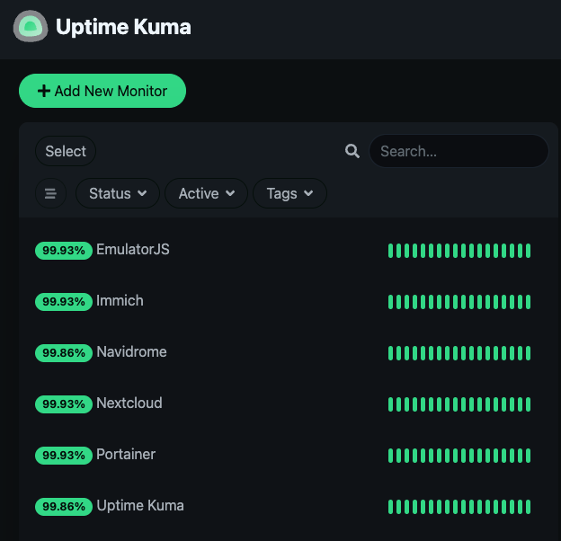

# 🖥️ Linux Homelab Server - Docker, Self-Hosting & Repurposed Hardware

A homelab built on a resurrected 10-year-old Acer Aspire, running self-hosted services over Tailscale. This repo documents the setup, the hardware decisions, and the things I learned along the way.

---

## 🧰 Skills & Technologies

| Category | Tools & Concepts |
|----------|-----------------|
| **OS & System** | Lubuntu, Linux CLI, systemd, headless server management |
| **Networking** | Tailscale (mesh VPN), SSH, remote access without port forwarding |
| **Containers** | Docker, Docker Compose, Portainer, multi-container stacks |
| **Databases** | PostgreSQL (Immich), Redis/Valkey (Immich caching) |
| **Monitoring** | Uptime Kuma (service health & alerting) |
| **Hardware** | Laptop disassembly, DC jack replacement, RAM/SSD upgrade, CMOS battery |
| **Self-Hosting** | Immich, Nextcloud, Navidrome, EmulatorJS, Uptime Kuma |

---

## 🏗️ Architecture Overview

The server runs headlessly on the Acer. I manage everything over SSH from my MacBook. Tailscale connects all devices into a private network so services are reachable from anywhere without exposing anything to the internet.

**Hardware**

| Component | Detail |
|-----------|--------|
| **Host** | Acer Aspire ES1-531-C8DA (~2015) |
| **CPU** | Intel Celeron N3050 (2-core, up to 2.16GHz) |
| **RAM** | 8GB (upgraded from 4GB) |
| **Storage** | Kingston SA400S37240G 240GB SSD (replaced original HDD) |
| **OS** | Lubuntu (headless) |

---

## 🛠️ Notable Decisions

**Going headless via SSH** — The Celeron N3050 is too underpowered to run a desktop environment alongside Docker containers. Switching to headless Lubuntu and SSHing in from my MacBook freed up enough resources to keep everything stable.

**Lubuntu over Ubuntu** — Standard Ubuntu with GNOME was too heavy for the hardware. Lubuntu's LXQt desktop is significantly lighter, and since there's no local display anyway, it's the right tradeoff.

**Tailscale for remote access** — Rather than opening ports on my router, Tailscale gives every device a stable private IP and handles encrypted routing automatically. No public exposure, zero port forwarding config.

**SSD over HDD** — Swapping the original spinning drive for a Kingston SSD made the single biggest performance difference. Boot times and Docker container startup both improved noticeably.

**Multi-container stack for Immich** — Immich runs as four containers: the app server, a machine learning service, PostgreSQL for the database, and Valkey (Redis) for caching. Managing this taught me how `depends_on`, `healthcheck`, and shared volumes work across a real multi-service stack.

**Uptime Kuma for monitoring** — Gives me a live view of whether each service is up, with alerting if something goes down. Useful day-to-day and was also how I first noticed the WiFi disconnection issue (see Known Issues).

---

## 📊 Service Status

---

## 🐳 Services

 
All services run in Docker, managed via Portainer.
 
### Storage & Files
- **Nextcloud** — Personal cloud storage and file sync across devices
- **Immich** — Self-hosted photo and video backup with PostgreSQL + Redis
 
### Media
- **Navidrome** — Music streaming server with Subsonic-compatible API
- **EmulatorJS** — Browser-based game emulation
 
### Infrastructure
- **Uptime Kuma** — Service health monitoring and uptime tracking
- **Portainer** — Docker container management UI
- **Tailscale** — Mesh VPN running on all devices for secure private access
 
---
 

## 🔧 Hardware Journey

The Acer was pulled out of retirement with a corrupted Windows 10 install and several hardware faults. Before any Linux work, the machine needed:

- **DC jack replaced** — laptop was cutting out whenever the cable was moved
- **RAM upgraded** — 4GB → 8GB for running Docker containers
- **HDD → SSD** — Seagate ST1000LM024 swapped for Kingston SA400S37240G
- **Main battery replaced** — original had significantly degraded
- **CMOS battery replaced** — was likely losing BIOS settings on power loss

Sorting the hardware first meant no mysterious instability once Linux was running.

---

## ⚠️ Known Issues

| Issue | Status |
|-------|--------|
| Acer intermittently drops WiFi connection, causing brief service outages visible in Uptime Kuma | Investigating — suspected power saving on the wireless adapter. Workaround: `systemctl restart NetworkManager` |

---

## 📌 Background

Started this in January 2026 after finding the old Acer sitting unused. The goal was to get real hands-on experience with Linux, networking, and self-hosted services — the kind of practical experience that's hard to get from coursework alone. Most of the real learning came from hardware that didn't cooperate and config that didn't work first time.

It's a work in progress. The roadmap below tracks what's next.

---

## 🗺️ Roadmap

**Up next**
- [ ] Fix WiFi disconnection issue — investigate `iwconfig` power management settings
- [ ] Reverse proxy (Caddy or Nginx Proxy Manager) for clean HTTPS access to services
- [ ] Proper backup strategy — offsite or at minimum a second drive
- [ ] Local DNS for reaching services by name instead of IP:port

**Exploring**
- [ ] Automated container updates (Watchtower or similar)
- [ ] Upgrade host hardware — a used mini PC would remove the CPU bottleneck
- [ ] Ansible for reproducible server configuration

---

## 📋 Changelog

| Date | Update |
|------|--------|
| Jan 2026 | Rediscovered the Acer — Windows 10 corrupted, constant BSODs |
| Jan 2026 | Replaced DC jack, upgraded RAM, swapped HDD for SSD, replaced batteries |
| Jan 2026 | Installed Ubuntu — worked but too slow, moved to Lubuntu |
| Jan 2026 | Switched to headless SSH workflow |
| Early 2026 | Installed Docker + Portainer |
| Early 2026 | Deployed Immich (+ PostgreSQL + Redis), Nextcloud, Navidrome |
| Early 2026 | Deployed EmulatorJS and Uptime Kuma |
| Early 2026 | Set up Tailscale across all devices |
| Mar 2026 | Added docker-compose files and full documentation to this repo |
